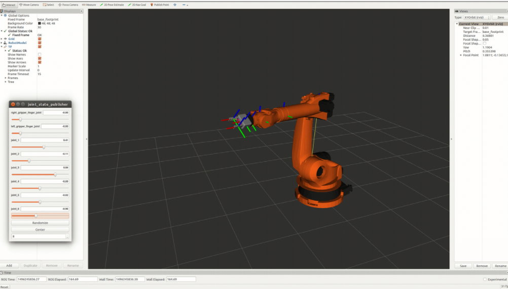
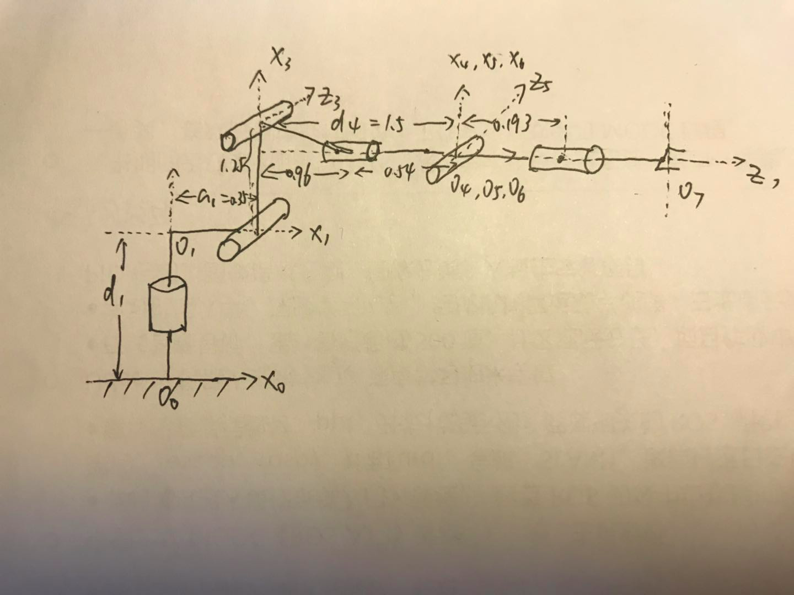
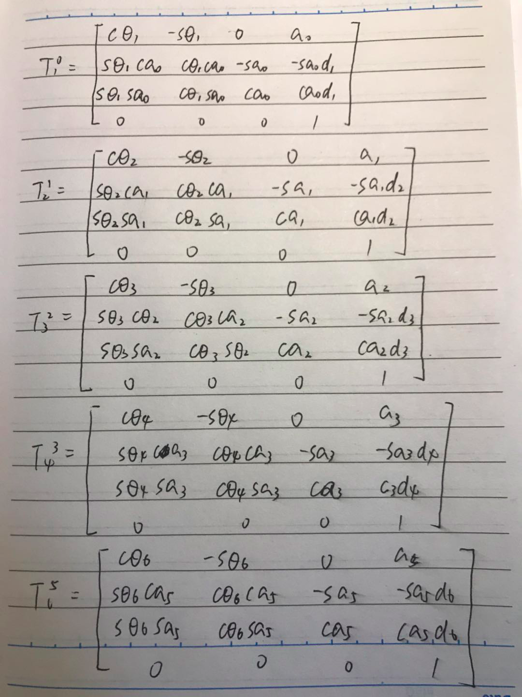
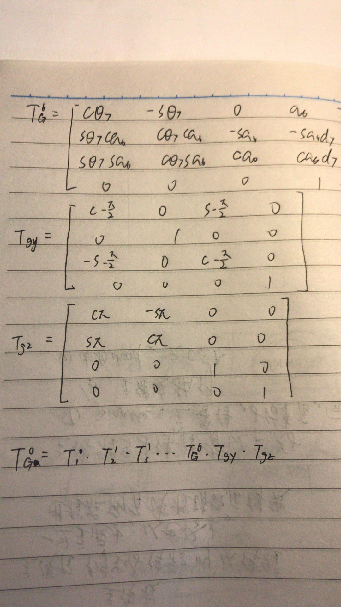
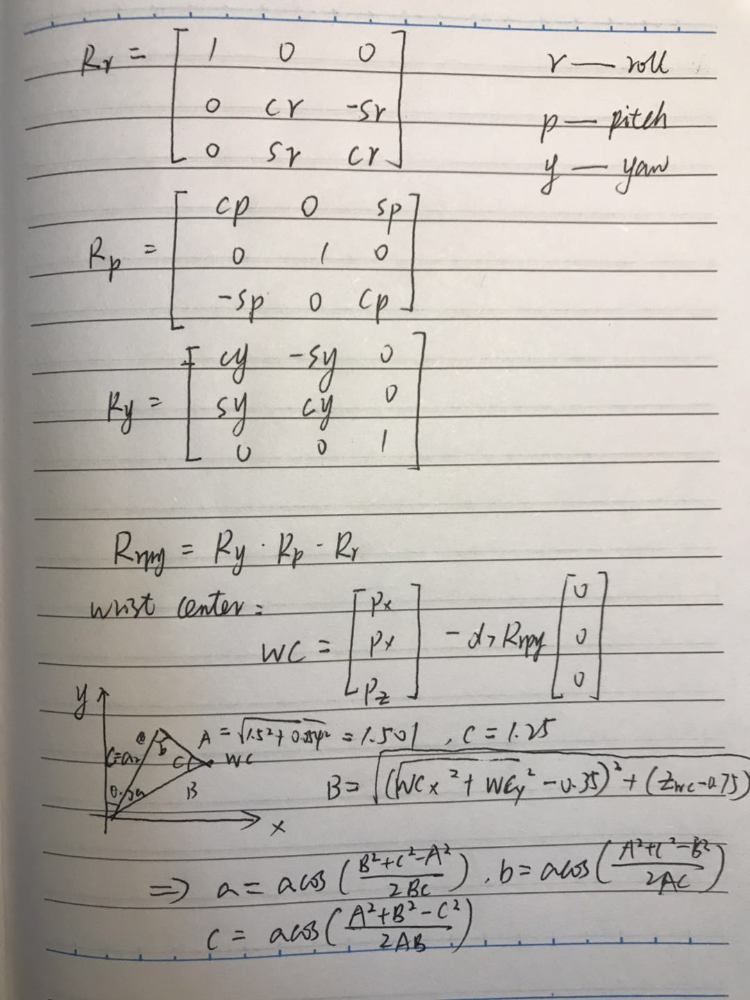
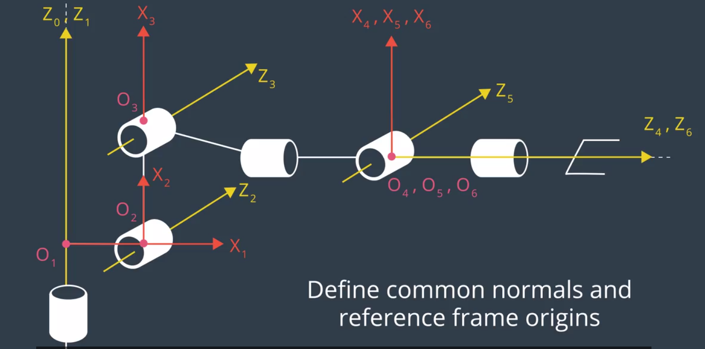
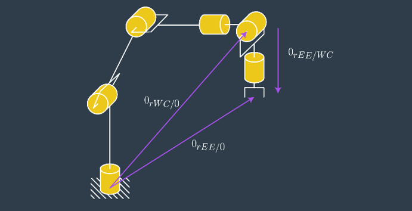
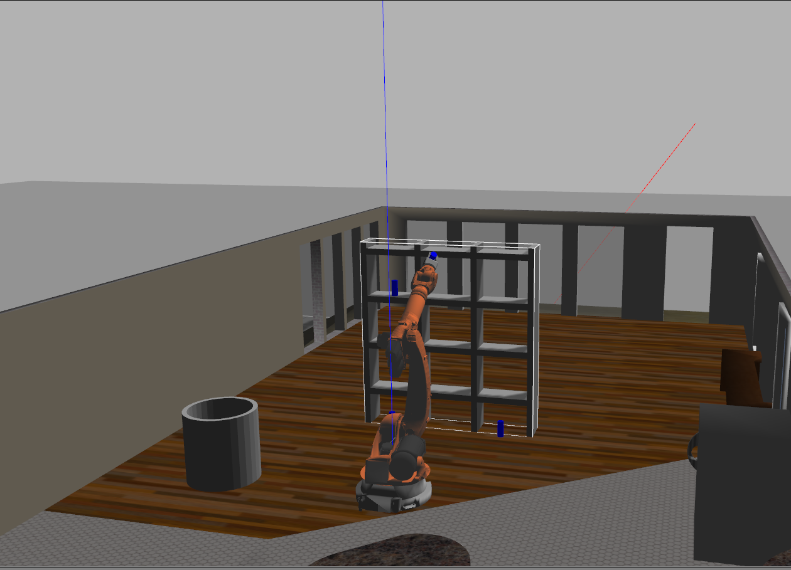

## Project: Kinematics Pick & Place
---
#### Email:sychaichangkun@gmail.com
#### Slack:@chaichangkun
---
**Steps to complete the project:**  

1. Set up your ROS Workspace.
2. Download or clone the [project repository](https://github.com/udacity/RoboND-Kinematics-Project) into the ***src*** directory of your ROS Workspace.  
3. Experiment with the forward_kinematics environment and get familiar with the robot.
4. Launch in [demo mode](https://classroom.udacity.com/nanodegrees/nd209/parts/7b2fd2d7-e181-401e-977a-6158c77bf816/modules/8855de3f-2897-46c3-a805-628b5ecf045b/lessons/91d017b1-4493-4522-ad52-04a74a01094c/concepts/ae64bb91-e8c4-44c9-adbe-798e8f688193).
5. Perform Kinematic Analysis for the robot following the [project rubric](https://review.udacity.com/#!/rubrics/972/view).
6. Fill in the `IK_server.py` with your Inverse Kinematics code.


## [Rubric](https://review.udacity.com/#!/rubrics/972/view) Points
### Here I will consider the rubric points individually and describe how I addressed each point in my implementation.  

---
### Writeup / README

#### 1. Provide a Writeup / README that includes all the rubric points and how you addressed each one.  You can submit your writeup as markdown or pdf.  

You're reading it!

### Kinematic Analysis
#### 1. Run the forward_kinematics demo and evaluate the kr210.urdf.xacro file to perform kinematic analysis of Kuka KR210 robot and derive its DH parameters.

I run forward_kinematics demo and change the joint angle using the joint state publisher, and I can see how each angle rotates and how it affects the end-effector. The `kr210.urdf.xacro` defines the translation and rotations between links and joints, but it's not in DH format. I derived the DH params from the beginning. I think it's easier to understant and represent in the urdf format.




#### 2. Using the DH parameter table you derived earlier, create individual transformation matrices about each joint. In addition, also generate a generalized homogeneous transform between base_link and gripper_link using only end-effector(gripper) pose.


Kinematics analysis

So the DH params can be built as follows.

Links | alpha(i-1) | a(i-1) | d(i) | theta(i)
--- | --- | --- | --- | ---
0->1 | 0 | 0 |  0.75 | 0
1->2 | - pi/2 | 0.55 | 0 | -pi/2 + q2
2->3 | 0 | 1.25 | 0 | 0
3->4 |  - pi/2 | -0.054 | 1.5 | 0
4->5 | pi/2 | 0 | 0 | 0
5->6 | - pi/2 | 0 | 0 | 0
6->EE | 0 | 0 | 0.303 | 0

The params can be obtained according to the urdf file which only describe the position and rotation between two links.

Transform Matrices is as follows.




#### 3. Decouple Inverse Kinematics problem into Inverse Position Kinematics and inverse Orientation Kinematics; doing so derive the equations to calculate all individual joint angles.
Extract end-effector position and orientation from request, that is
px,py,pz and roll, pitch, yaw.



So the wrist center(wx,wy,wz) can be derived from the end-effector position and R0_6.

theta1 = atan2(wy, wx) and theta2 and theta3 can be calcucated by

theta2 = pi/2-theta2_2-theta2_1,

theta3 = pi/2 - theta3_2-theta3_1.

theta4=atan2(new_R3_6[2,2],-new_R3_6[0,2])

theta5=atan2(sin_theta5, new_R3_6[1,2])

theta6=atan2(-new_R3_6[1,1],new_R3_6[1,0])




### Project Implementation

#### 1. Fill in the `IK_server.py` file with properly commented python code for calculating Inverse Kinematics based on previously performed Kinematic Analysis. Your code must guide the robot to successfully complete 8/10 pick and place cycles. Briefly discuss the code you implemented and your results.
The trajectory was drawn correctly , and the arm followed it.
Here is the main implementation of my code.
It can successfully pick 8 out of 10 objects, while sometimes reaches the pick place but fails to hold the object tightly.
```python
           # Extract end-effector position and orientation from request
           # px,py,pz = end-effector position
           # roll, pitch, yaw = end-effector orientation
           px = req.poses[x].position.x
           py = req.poses[x].position.y
           pz = req.poses[x].position.z

           roll, pitch, yaw = tf.transformations.euler_from_quaternion(
           [req.poses[x].orientation.x, req.poses[x].orientation.y,
            req.poses[x].orientation.z, req.poses[x].orientation.w])

           # Calculate joint angles using Geometric IK method
           R_roll = Matrix([[ 1,           0,          0],
                            [ 0,   cos(roll), -sin(roll)],
                            [ 0,   sin(roll),  cos(roll)]])

           R_pitch = Matrix([[ cos(pitch), 0,  sin(pitch)],
                             [       0,    1,           0],
                             [-sin(pitch), 0,  cos(pitch)]])

           R_yaw = Matrix([[ cos(yaw), -sin(yaw),       0],
                           [ sin(yaw),  cos(yaw),       0],
                           [ 0,              0,        1]])


           R0_6 = R_yaw*R_pitch*R_roll*R_corr

           # Calculate wc point
           wx = px - 0.303 * R0_6[0,2]
           wy = py - 0.303 * R0_6[1,2]
           wz = pz - 0.303 * R0_6[2,2]
           a1=0.35
           a2=1.25
           a3=-0.054
           d1=0.75
           d4=1.50

           # theta1
           theta1 = atan2(wy, wx)

           #distance
           dis_2_3=a2
           dis_2_4=sqrt((sqrt(wx**2+wy**2)-a1)**2+(wz-d1)**2)
           dis_3_4=sqrt(d4**2+a3**2)

           # theta2
           cos_theta2_1=(dis_2_4**2+dis_2_3**2-dis_3_4**2)/(2*dis_2_4*dis_2_3)
           sin_theta2_1=sqrt(1-cos_theta2_1**2)
           theta2_1 = atan2(sin_theta2_1,cos_theta2_1)
           sin_theta2_2=(wz-d1)/(dis_2_4)
           cos_theta2_2=sqrt(1-sin_theta2_2**2)
           theta2_2 = atan2(sin_theta2_2,cos_theta2_2)
           theta2 = pi/2-theta2_2-theta2_1

           #theta3
           theta3_1=atan2(a3,d4)
           cos_theta3_2 = (dis_2_3**2+dis_3_4**2-dis_2_4**2)/(2*dis_2_3*dis_3_4)
           sin_theta3_2 = sqrt(1-cos_theta3_2**2)
           theta3_2 = atan2(sin_theta3_2,cos_theta3_2)
           theta3 = pi/2 - theta3_2-theta3_1

           # Calculate R0_3  
           R0_3 = T0_3.evalf(subs={q1:theta1, q2:theta2, q3:theta3})[0:3, 0:3]

           # Calculate new_R3_6
           new_R3_6 = R0_3.transpose() * R0_6

           # theta4,theta5,theta6
           theta4=atan2(new_R3_6[2,2],-new_R3_6[0,2])
           sin_theta5=sqrt(new_R3_6[2,2]**2+new_R3_6[0,2]**2)
           theta5=atan2(sin_theta5, new_R3_6[1,2])
           theta6=atan2(-new_R3_6[1,1],new_R3_6[1,0])
```


The result of IK_server.py code:

